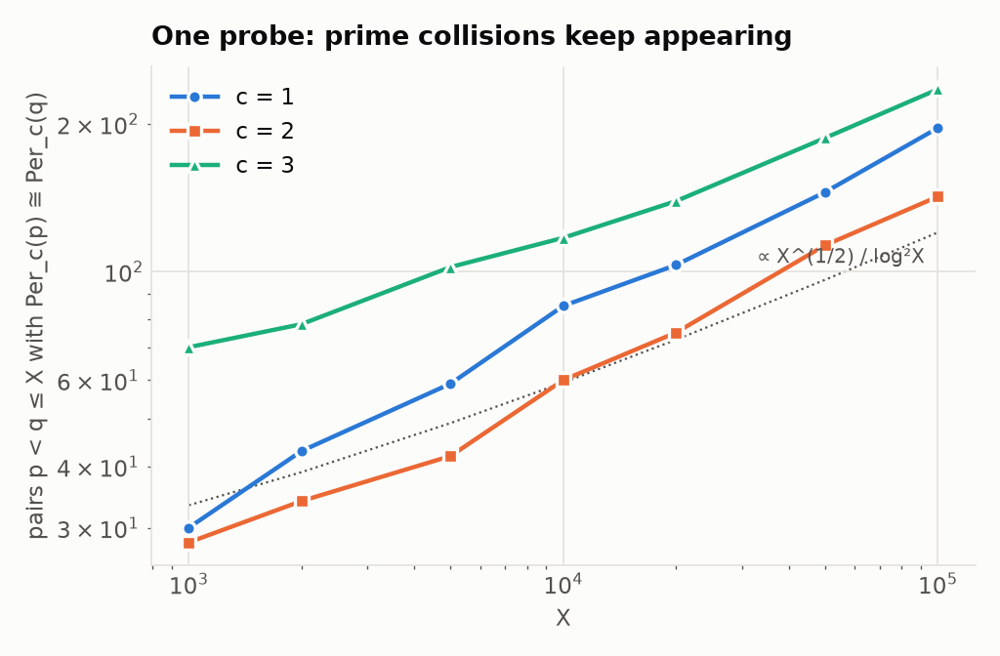
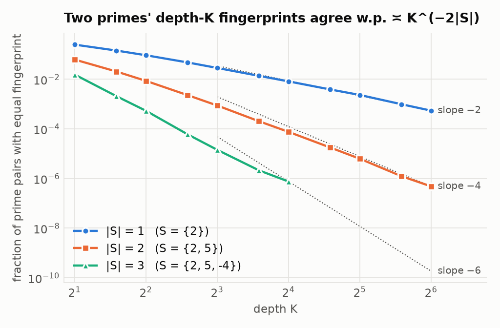
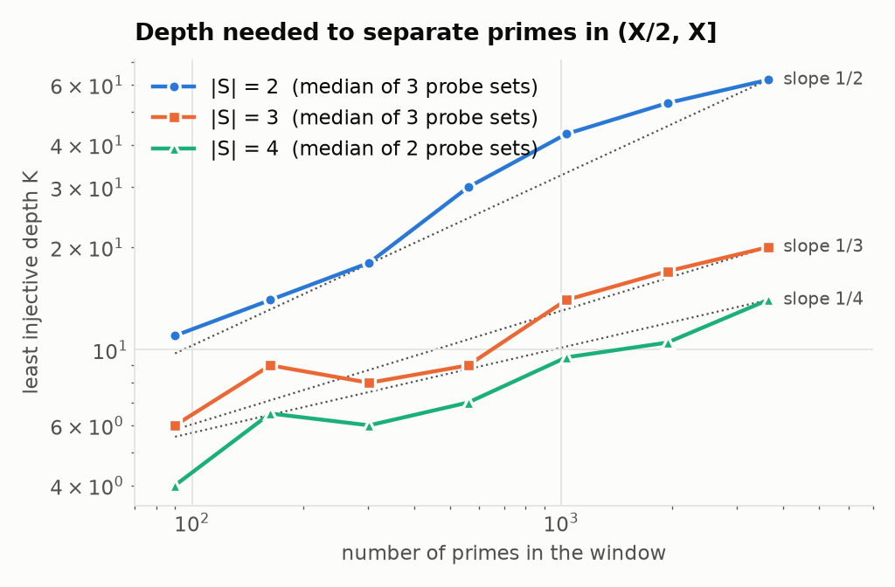

# Arithmetic Dynamical Tomography: Foundations, Obstructions, and a Tomographic Reformulation

*A theoretical companion to the research proposal “Arithmetic Dynamical Tomography: Reconstructing Integers from Polynomial Orbit Data”.*

**Abstract.** The proposal asks whether the prime factorisation of an integer $n$ can be recovered from periodic-point counts of quadratic maps $x\mapsto x^2+c$ on $\mathbb Z/n\mathbb Z$. We develop the foundations of this inverse problem.

The full-depth fingerprint is an element of the Burnside ring of $\widehat{\mathbb Z}$, equivalently of the big Witt ring. The Chinese remainder theorem makes it multiplicative into a semiring that is neither cancellative nor factorial. We prove four structural facts:

* collisions always occur in infinite families;
* the fingerprint depends only on the coordinate marginals of the multiset of prime types, so reconstruction is a discrete-tomography problem whose obstruction is the switching component;
* at bounded depth the fingerprint depends only on Frobenius classes in a finite Galois group;
* prime powers are invisible below an explicit multiplier-order threshold.

For the exactly solvable probes $c=0,-2$ we give closed forms, prove that together they separate all primes, and exhibit the collision $65\sim119$. A Poisson–Chebotarev model, grounded in the Galois theory of dynatomic polynomials, predicts that the depth $K$ and the number of probes $|C|$ must satisfy $|C|\log K\approx\log X$. This refutes polylogarithmic depth heuristically. All predictions are tested numerically. For the proposal’s probe set $\{-3,\dots,3\}$ we find no collision among the odd squarefree integers $n\le10^6$.

**Keywords.** Arithmetic dynamics; functional graphs; periodic points; dynatomic polynomials; Burnside ring; Witt vectors; Chebotarev density theorem; discrete tomography; integer factorisation.

**MSC 2020.** 37P05, 37P25, 11R45, 11Y05, 19A22.

> **How to read this document.** Each statement carries a status label:
>
> * **Theorem / Proposition / Lemma**: proved here, sometimes using a cited standard result.
> * **Heuristic**: derived from an explicit probabilistic model; not a proof.
> * **Observation**: a finite computation, reproducible with the code in [`code/`](../code) (see [`README.md`](../README.md)).
> * **Conjecture**: a precise statement we believe, with the evidence stated.
>
> The proposal itself warns that functional graphs, arithmetic dynamics and dynamical zeta functions have large literatures; the same caution applies here (§11).

---

## Contents

0. [Summary and verdicts](#0-summary-and-verdicts)
1. [Setting and notation](#1-setting-and-notation)
2. [The Burnside–Witt formalism](#2-the-burnsidewitt-formalism)
3. [Local theory at a prime](#3-local-theory-at-a-prime)
4. [The two exactly solvable probes](#4-the-two-exactly-solvable-probes)
5. [Global structure: collisions and discrete tomography](#5-global-structure-collisions-and-discrete-tomography)
6. [Obstructions at bounded depth](#6-obstructions-at-bounded-depth)
7. [Prime powers](#7-prime-powers)
8. [The Poisson–Chebotarev model and the tomographic uncertainty principle](#8-the-poissonchebotarev-model-and-the-tomographic-uncertainty-principle)
9. [Complexity: what the fingerprint costs](#9-complexity-what-the-fingerprint-costs)
10. [Revised conjectures, answers to the proposal’s questions, and a research plan](#10-revised-conjectures-answers-to-the-proposals-questions-and-a-research-plan)
11. [References](#11-references)

---

## 0. Summary and verdicts

The proposal asks whether the prime factorisation of an odd squarefree integer $n$ can be read off from periodic-point counts of a few quadratic maps $f_c(x)=x^2+c$ on $\mathbb Z/n\mathbb Z$. We develop the theory far enough to settle most of its conjectures, in several cases negatively. The main findings are these.

1. **The right algebraic home is the Burnside ring of $\widehat{\mathbb Z}$** (equivalently the big Witt ring). The full-depth fingerprint of $n$ for a probe $c$ *is* the isomorphism class of a finite $\mathbb Z$-set. CRT makes $n\mapsto$ fingerprint a monoid homomorphism into a semiring that is **neither cancellative nor factorial** (§2).
2. **Collisions come in infinite families** (Theorem 5.1). One collision $n\sim m$ forces $nr\sim mr$ for every coprime $r$. So the Reconstruction Conjecture’s “finite set of collisions” must be *empty*: the conjecture is equivalent to exact injectivity.
3. **The fingerprint only sees marginals** (Theorem 5.3). $\mathrm{ADF}_{C,\infty}(n)$ depends only on the $|C|$ one-dimensional projections of the multiset of local types of the primes dividing $n$. Recovering $n$ is therefore *literally* a discrete-tomography problem. Its non-uniqueness mechanism is the classical **switching component**. Example: $65=5\cdot 13$ and $119=7\cdot17$ have identical periodic structure for $x^2$ and $x^2-2$ (Example 5.5).
4. **Bounded depth sees only Frobenius content** (Theorem 6.1). At each fixed depth the fingerprint of $n$ is a function of the multiset of Frobenius classes of its prime factors in one finite Galois group. Hence bounded-depth reconstruction is impossible. Unconditionally the depth must grow at least like $\sqrt{\log X}$ (Theorem 6.3). For the probe $x^2$ it must exceed $X^{1/8-\varepsilon}$ (Theorem 6.4).
5. **Prime powers are invisible below a multiplier-order threshold** (Theorem 7.1). $\mathrm{ADF}_{C,K}(p^e)=\mathrm{ADF}_{C,K}(p)$ for all but finitely many $p$. The depth needed to see $p^2$ is $T_c(p)=\min \ell\cdot\mathrm{ord}_p(\lambda)$ over cycles, typically about $p^{0.9}$. Primes whose only cycle passes through the critical point are invisible *at every depth*: $41^e$ has the same fingerprint as $41$ for the probes $\{1,2\}$ (Observation 7.4).
6. **Depth–width trade-off** (Heuristic 8.3, confirmed numerically). Under a Poisson–Chebotarev model backed by the Galois theory of dynatomic polynomials, separating primes up to $X$ needs $|C|\log K\gtrsim\log X$, i.e. $K\approx X^{1/|C|}$. The Finite-Depth Conjecture (polylogarithmic $K$, bounded $|C|$) is false under this model.
7. **Exactly solvable probes.** For $c=0,-2$ the periodic structure is explicit through multiplicative orders (Theorems 4.1–4.2). The pair $\{0,-2\}$ separates all primes (Theorem 4.3) but not all composites. Among all $1{,}555{,}366$ odd semiprimes up to $10^7$ the *only* collision is $65\sim119$ (Observation 5.6).
8. **The unlabeled graph always determines $n$** (Theorem 2.7). This follows from indegree statistics alone and resolves Theorem target D. It also shows that such information is as hard to compute as factoring. What makes ADT interesting is that periodic data discards this easy information.
9. **Cross-probe identities.** $\Phi_2(x,c)=\Phi_1(-x,c+1)$, and minus the sum of every 3-cycle of $f_c$ is a fixed point of $f_{c+2}$ (Proposition 3.3). The proposal’s consecutive probe set $\{-3,\dots,3\}$ therefore carries only **5** independent quadratic characters at depth $\le 2$. This predicts a depth-2 collision rate $2^{-5}$, and we measure $3.1\cdot10^{-2}$ (Proposition 6.2, Observation 10.2).
10. **Complexity.** Depth-1 entries are exactly a quadratic-residuosity oracle. The number of periodic points of $x\mapsto x^2$ factors any semiprime in deterministic polynomial time. The only efficiently computable *multiplicative* shadows we know are Jacobi symbols of dynamical discriminants (§9).
11. **The proposal’s probe set looks injective.** For $C=\{-3,\dots,3\}$ there is **no collision** among all $405{,}285$ odd squarefree $n\le10^6$ (Observation 5.7), nor among the $3.2$ million $n\le10^7$ with all prime factors below $10^6$.

### Verdicts on the proposal’s conjectures and targets

| Item | Verdict | Where |
|---|---|---|
| Reconstruction Conjecture (finite exceptional set) | Equivalent to *exact* injectivity. **False** for $C\subseteq\{0,-2\}$, for single generic probes (heuristically, and with many observed prime collisions), and for 26 of 45 probe pairs tested (explicit prime collisions). **Open and plausible** for the proposal’s $C=\{-3,\dots,3\}$: no collision up to $10^6$. | §5, §8 |
| Finite-Depth Conjecture ($K\le B(\log n)^A$) | Bounded depth impossible (Thm 6.1). $K\gg\sqrt{\log X}$ unconditionally (Thm 6.3). False at any depth $\le X^{1/8-\varepsilon}$ for $C=\{0\}$ (Thm 6.4). False for every $C$ under the Poisson–Chebotarev model, where the correct scale is $K\approx X^{1/\lvert C\rvert}$ (Heur. 8.3, Fig. 3). | §6, §8 |
| Prime-Power Rigidity ($K$ depending only on $e$) | **False**: $\mathrm{ADF}_{C,K}(p^e)=\mathrm{ADF}_{C,K}(p)$ for all $p\nmid D_{C,K}$. The needed depth is the multiplier-order threshold, and some probe sets are blind at every depth. | §7 |
| Efficient Oracle Conjecture | As stated, equivalent to efficient deterministic factoring (any factoring algorithm is a “probe statistic”). Needs a restricted model; reformulated as Problem 10.6. | §9 |
| Target A (multiplicative tomography) | Closed formulas at depths 1–2, cross-probe constraints at depths 3–4, a Frobenian law at every depth, and a complete classification of depth-$\le2$ collisions. | §3, §6 |
| Target B (semiprime separation) | $K(X)\to\infty$ is forced. For $C=\{-3..3\}$: $K(10^3),\dots,K(10^6)=4,9,12,20$. For $C=\{0,-2\}$ the unique semiprime collision below $10^7$ is $65\sim119$. | §5, §6 |
| Target C (prime-power lifting) | Theorem 7.1: separable roots never lift visibly; the threshold is $\min \ell\cdot\mathrm{ord}(\lambda)$; critical cycles never lift. | §7 |
| Target D (graph reconstruction) | Solved affirmatively for odd squarefree $n$ and every $c$, by indegree statistics (Thm 2.7). | §2 |

---

## 1. Setting and notation

Throughout, $c\in\mathbb Z$, $f_c(x)=x^2+c$, and $n$ is an odd squarefree integer unless stated otherwise; $p$ is an odd prime.

* $G_c(n)$ is the functional digraph $x\to f_c(x)$ on $\mathbb Z/n\mathbb Z$.
* $\mathrm{Per}_c(n)\subseteq\mathbb Z/n\mathbb Z$ is the set of periodic points. $f_c$ permutes it, so it is a finite $\mathbb Z$-set, a set with a permutation $\sigma$.
* $P_c(n,k)=\#\{x: f_c^{\circ k}(x)=x\}$ and $N^{(c)}_d(n)$ is the number of cycles of length $d$.
* $N_c(n)=|\mathrm{Per}_c(n)|$ is the total number of periodic points.
* $\nu(k)=\sum_{d\mid k}\mu(k/d)2^d$ and $\Phi_k(x,c)$ is the $k$-th dynatomic polynomial, so that $f_c^{\circ k}(x)-x=\prod_{d\mid k}\Phi_d(x,c)$ and $\deg_x\Phi_k=\nu(k)$.
* $\Delta(c)=1-4c$ is the discriminant of $\Phi_1(x,c)=x^2-x+c$.
* For a finite probe set $C\subset\mathbb Z$ and depth $K\in\mathbb N\cup\{\infty\}$, the **arithmetic dynamical fingerprint** is $\mathrm{ADF}_{C,K}(n)=(P_c(n,k))_{c\in C,\,1\le k\le K}$.
* Two integers **collide** (for $C,K$) if they have equal fingerprints.

---

## 2. The Burnside–Witt formalism

### 2.1 Finite ℤ-sets and marks

Let $\Omega^+$ be the set of isomorphism classes of finite $\mathbb Z$-sets. It is a commutative semiring under disjoint union and cartesian product, and its group completion $\Omega$ is the Burnside ring of finite $\mathbb Z$-sets. Every finite $\mathbb Z$-set is a disjoint union of cycles, so $\Omega$ is free abelian on the transitive classes $[\mathbb Z/d]$ ($d\ge1$), with $[1]=[\mathbb Z/1]$ the unit.

**Lemma 2.1 (product rule).** $[\mathbb Z/a]\cdot[\mathbb Z/b]=\gcd(a,b)\,[\mathbb Z/\mathrm{lcm}(a,b)]$.

*Proof.* The stabiliser of a point of $\mathbb Z/a\times\mathbb Z/b$ is $a\mathbb Z\cap b\mathbb Z=\mathrm{lcm}(a,b)\mathbb Z$. So every orbit has size $\mathrm{lcm}(a,b)$, and there are $ab/\mathrm{lcm}(a,b)=\gcd(a,b)$ of them. ∎

For $k\ge1$ the **mark** $\varphi_k(X)=|\{x\in X:\sigma^k x=x\}|$ is additive and multiplicative, i.e. a ring homomorphism $\Omega\to\mathbb Z$. Since $\varphi_k([\mathbb Z/d])=d\cdot[d\mid k]$, the mark matrix is triangular, which gives Möbius inversion. The number of points of exact period $d$ is $\sum_{e\mid d}\mu(d/e)\varphi_e(X)$, and dividing by $d$ gives the number of $d$-cycles.

**Lemma 2.2 (depth = truncation).** For every $K\ge1$ the vectors $(\varphi_1(X),\dots,\varphi_K(X))$ and $(N_1(X),\dots,N_K(X))$ determine each other. The marks for all $k$ determine $X$ up to isomorphism.

*Proof.* The inversion formula for $d$ involves only divisors of $d$. ∎

### 2.2 The periodic ℤ-set and CRT

Every solution of $f_c^{\circ k}(x)=x$ is periodic, so $P_c(n,k)=\varphi_k(\mathrm{Per}_c(n))$.

**Proposition 2.3 (CRT).** If $\gcd(a,b)=1$ then $G_c(ab)\cong G_c(a)\times G_c(b)$ (categorical product of functional graphs) and $\mathrm{Per}_c(ab)\cong\mathrm{Per}_c(a)\times\mathrm{Per}_c(b)$ as $\mathbb Z$-sets.

*Proof.* The ring isomorphism $\mathbb Z/ab\cong\mathbb Z/a\times\mathbb Z/b$ commutes with the polynomial $f_c$, and a pair is periodic iff both coordinates are. ∎

**Corollary 2.4.** $n\mapsto[\mathrm{Per}_c(n)]$ is a homomorphism from the multiplicative monoid of odd squarefree integers to $(\Omega^+,\times)$. Consequently:

* $\mathrm{ADF}_{C,K}(n)$ is equivalent to the table $\big(N^{(c)}_d(n)\big)_{c\in C,\ d\le K}$ of short-cycle counts;
* $\mathrm{ADF}_{C,\infty}(n)$ is equivalent to the tuple of isomorphism classes $\big([\mathrm{Per}_c(n)]\big)_{c\in C}$;
* $\mathrm{ADF}_{C,\infty}(n)=\prod_{p\mid n}\mathrm{ADF}_{C,\infty}(p)$, computed in $(\Omega^+)^C$.

*Observation 2.5.* Direct enumeration and CRT synthesis agree exactly for all 1,372 composite test moduli and all 7 probes of the proposal (`code/validate.py`).

### 2.3 Zeta functions live in the Witt ring

The proposal’s finite-modulus Artin–Mazur zeta function is

$$
Z_{c,n}(T)=\exp\Big(\sum_{k\ge1}\frac{P_c(n,k)}{k}T^k\Big)=\prod_{d\ge1}\big(1-T^d\big)^{-N^{(c)}_d(n)} .
$$

The second equality follows from $P_c(n,k)=\sum_{d\mid k}dN_d$. By Lemma 2.2 it carries exactly the information of $\mathrm{ADF}_{c,\infty}(n)$.

The multiplicative structure is **not** the ordinary product of power series. Under the Dress–Siebeneicher isomorphism between the Burnside ring of $\widehat{\mathbb Z}$ and the big Witt ring $W(\mathbb Z)$ [DS89], the map $X\mapsto\zeta_X$ sends disjoint union to the product of power series (Witt addition). It sends cartesian product to Witt multiplication, and marks are ghost components. Hence

$$
Z_{c,ab}=Z_{c,a}\ \ast_W\ Z_{c,b}\qquad(\gcd(a,b)=1),
$$

The “Euler product over cycles” expresses $Z_{c,n}$ in Witt (necklace) coordinates, whose exponents are the cycle counts $N_d$. The periodic-point counts $P_c(n,k)$ are its ghost components, and these multiply coordinatewise.

### 2.4 The semiring is neither cancellative nor factorial

**Proposition 2.6.**
1. *(No cancellation.)* If every cycle length of $Y$ is even then $[\mathbb Z/2]\cdot Y=2\cdot Y$. For instance $[\mathbb Z/2]\cdot[\mathbb Z/2]=(2[1])\cdot[\mathbb Z/2]$ although $[\mathbb Z/2]\neq 2[1]$.
2. *(No unique factorisation.)* $[\mathbb Z/2][\mathbb Z/15]=[\mathbb Z/6][\mathbb Z/5]=[\mathbb Z/10][\mathbb Z/3]=[\mathbb Z/30]$.
3. *(Absorption.)* $X\cdot Y=X'\cdot Y$ iff $\varphi_k(X)=\varphi_k(X')$ for every $k$ divisible by some cycle length of $Y$. In particular, a prime $q\mid n$ with no fixed point for $f_c$ erases the value $P_c(\cdot,1)$ of the cofactor.

*Proof.* (1) and (2) follow from Lemma 2.1. (3) holds because marks are faithful and multiplicative, and $\varphi_k(Y)\neq0$ iff some cycle length of $Y$ divides $k$. ∎

These two failures are the algebraic sources of all collisions (§5).

### 2.5 Beyond periodic data: the unlabeled graph always determines *n*

**Theorem 2.7 (indegree reconstruction).** Let $n=p_1\cdots p_r$ be odd squarefree, $c\in\mathbb Z$, and $I_j=\#\{y\in\mathbb Z/n:\ \mathrm{indeg}_{G_c(n)}(y)=2^j\}$. Then

$$
\sum_{j\ge0}I_j\,t^j=\prod_{i=1}^r\Big(1+\frac{p_i-1}{2}\,t\Big).
$$

In particular the isomorphism class of the *unlabeled* digraph $G_c(n)$ determines the prime factorisation of $n$, for every $c$.

*Proof.* Modulo $p$, $y$ has $1+\big(\tfrac{y-c}{p}\big)$ preimages (Legendre symbol, with $(\tfrac0p)=0$). So $y=c$ has indegree 1, and exactly $(p-1)/2$ residues have indegree 2. Indegree is multiplicative under the product of Proposition 2.3. Hence $\mathrm{indeg}(y)=2^j$ iff exactly $j$ coordinates have indegree $2$ and the others equal $c$. There are $e_j\big(\tfrac{p_1-1}2,\dots,\tfrac{p_r-1}2\big)$ such $y$. ∎

*Remarks.*
1. Target D asks when the direct-product decomposition is recoverable from the unlabeled graph. For odd squarefree $n$ the answer is *always*: Theorem 2.7 recovers the primes, hence each factor $G_c(p_i)$.
2. The theorem also illustrates the proposal’s Failure Mode 2 sharply. For $n=pq$ one has $I_1=(p+q-2)/2$, so computing $I_1$ *is* factoring.
3. The substance of ADT therefore lies in the periodic data, which discards the tree structure where this easy information lives.
4. Two further multiplicative observables are available: the height profile $H_n(t)=\#\{x: f_c^{\circ t}(x)\in\mathrm{Per}_c(n)\}$ satisfies $H_{ab}=H_aH_b$, and the critical point $0$ is graph-intrinsic (the unique preimage of the unique indegree-1 vertex), so the preperiod and period of the critical orbit are isomorphism invariants. They equal the maximum and the lcm of the local ones.

---

## 3. Local theory at a prime

### 3.1 Separability

**Lemma 3.1.** For $c\in\mathbb Z$ and $k\ge1$, $F_{c,k}(x):=f_c^{\circ k}(x)-x$ is separable over $\mathbb Q$. A root $\alpha$ (in $\overline{\mathbb Q}$ or $\overline{\mathbb F}_p$) of exact period $\ell\mid k$ is multiple iff its cycle multiplier $\lambda=\prod_{i<\ell}2f_c^{\circ i}(\alpha)$ satisfies $\lambda^{k/\ell}=1$.

*Proof.* The chain rule gives $F_{c,k}'(\alpha)=(f_c^{\circ k})'(\alpha)-1=\lambda^{k/\ell}-1$. Over $\mathbb Q$ the roots are algebraic integers, since $F_{c,k}$ is monic in $\mathbb Z[x]$. So $\lambda\in 2^\ell\overline{\mathbb Z}$, and $\lambda^{k/\ell}=1$ would make $2^k$ a unit in $\overline{\mathbb Z}$, which is impossible. ∎

So there are no parabolic cycles over $\mathbb Z$. Let $D_{c,k}=2\,\mathrm{disc}(F_{c,k})\neq0$ and $D_{C,K}=\prod_{c\in C,k\le K}D_{c,k}$.

### 3.2 The Frobenian law

Let $R_{c,k}$ be the roots of $F_{c,k}$, $L_{c,k}=\mathbb Q(R_{c,k})$ and $G_{c,k}=\mathrm{Gal}(L_{c,k}/\mathbb Q)$.

**Theorem 3.2.** For $p\nmid D_{c,k}$, $P_c(p,k)$ equals the number of roots in $R_{c,k}$ fixed by $\mathrm{Frob}_p$. Consequently:

1. $P_c(p,k)$ depends only on the conjugacy class of $\mathrm{Frob}_p$ in $G_{c,k}$;
2. $\sum_{p\le X}P_c(p,k)\sim r_{c,k}\,\pi(X)$, where $r_{c,k}$ is the number of irreducible factors of $F_{c,k}$ over $\mathbb Q$;
3. if every $\Phi_d(x,c)$ ($d\mid k$) is irreducible over $\mathbb Q$ then $r_{c,k}=\tau(k)$, the number of divisors of $k$. By Bousch [Bou92] and Morton [Mor98], this holds over $\mathbb Q(c)$; by Hilbert irreducibility it holds for all $c\in\mathbb Z$ outside a thin set.

*Proof.* For unramified $p$ the reduction map identifies $R_{c,k}$ with the roots of $F_{c,k}\bmod p$ equivariantly for Frobenius, and the $\mathbb F_p$-rational roots are the Frobenius-fixed ones. For (2), Chebotarev together with Burnside’s lemma gives an average number of fixed points equal to the number of orbits. For (3), $F_{c,k}=\prod_{d\mid k}\Phi_d$. ∎

*Observation 3.2′ (means over primes $50<p<10^5$).*

| $k$ | 1 | 2 | 3 | 4 | 5 | 6 | 7 | 8 |
|---|---|---|---|---|---|---|---|---|
| $\tau(k)$ | 1 | 2 | 2 | 3 | 2 | 4 | 2 | 4 |
| $c=1$ | 0.998 | 1.994 | 1.999 | 2.982 | 1.962 | 3.968 | 1.997 | 4.000 |
| $c=2$ | 0.997 | 1.995 | 1.982 | 2.987 | 2.008 | 3.959 | 2.030 | 3.992 |
| $c=3$ | 0.998 | 1.997 | 1.994 | 2.985 | 1.973 | 3.940 | 1.988 | 4.000 |
| $c=7$ | 0.998 | 1.999 | 2.010 | 3.015 | 1.980 | 3.942 | 1.973 | 3.999 |

The integers in the proposal’s set are *not* all generic. For $c=-j(j+1)$ ($c=0,-2,-6,\dots$) $\Phi_1$ splits over $\mathbb Q$: there are two rational fixed points. For $c=-(s^2+3)/4$ ($c=-1,-3,-7,\dots$) $\Phi_2$ splits: there is a rational 2-cycle, e.g. $\{0,-1\}$ for $c=-1$ and $\{1,-2\}$ for $c=-3$. For $c=-2$ both $\Phi_3$ and $\Phi_4$ factor, with degrees $3+3$ and $4+8$. For $c=0$, $\Phi_3$ is the 7th cyclotomic polynomial, irreducible, while $\Phi_4$ factors as $4+8$. In both cases the Galois groups are abelian (§4). **Only $c\in\{1,2,3\}$ of the proposal’s seven probes are generic.**

### 3.3 Closed forms at small depth and cross-probe identities

**Proposition 3.3.**
1. $\Phi_1(x,c)=x^2-x+c$ and $\Phi_2(x,c)=x^2+x+c+1=\Phi_1(-x,c+1)$. The discriminants are $\Delta(c)$ and $\Delta(c+1)$.
2. *(3-cycles.)* $\mathrm{Res}_x\big(\Phi_3(x,c),\,s-(x+f_c(x)+f_c^{\circ2}(x))\big)=(s^2+s+c+2)^3$. Hence **minus the sum of every 3-cycle of $f_c$ is a fixed point of $f_{c+2}$**. Equivalently, the sum is a point of period dividing 2 for $f_{c+1}$. Also $\mathrm{disc}_x\Phi_3=-(4c+7)^3(16c^2+4c+7)^2$, whose square class is $\Delta(c+2)$.
3. *(4-cycles.)* The same resultant for $\Phi_4$ equals $(s^3+(4c+3)s+4)^4$.

*Proof.* These are polynomial identities in $\mathbb Z[c,x,s]$, verified symbolically with `sympy` (`code/symbolic_identities.py`). They remain valid after reduction modulo any prime. For monic $\Phi$, $\mathrm{Res}_x(\Phi,g)=\prod_{\Phi(\alpha)=0}g(\alpha)$. For (2) there is also a short hand proof. For a 3-cycle $x_1\to x_2\to x_3$, multiplying $x_{i+1}-x_{j+1}=(x_i-x_j)(x_i+x_j)$ around the cycle gives $\prod(x_i+x_j)=1$. Comparing $\sum x_i^2=\sigma-3c$ with $\sum x_ix_{i+1}=\sum x_i^3+c\sigma$ then yields $(2\sigma-3)(\sigma^2+\sigma+c+2)=0$, where $\sigma=x_1+x_2+x_3$; the resultant identity excludes the branch $\sigma=3/2$. ∎

**Corollary 3.4 (depth $\le2$ in closed form; cross-probe constraints).** Let $p\nmid 2\Delta(c)\Delta(c+1)$.

$$
P_c(p,1)=1+\Big(\frac{\Delta(c)}{p}\Big),\qquad
P_c(p,2)=2+\Big(\frac{\Delta(c)}{p}\Big)+\Big(\frac{\Delta(c+1)}{p}\Big).
$$

* If $\big(\tfrac{\Delta(c+2)}{p}\big)=-1$, i.e. $f_{c+2}$ has no fixed point mod $p$, then $f_c$ has **no 3-cycle** in $\mathbb F_p$.
* If $s^3+(4c+3)s+4$ has no root mod $p$ then $f_c$ has no 4-cycle in $\mathbb F_p$.

*Observation 3.5.* Among 29,239 pairs $(p,c)$ with a rational 3-cycle ($p<10^5$, ten values of $c$), the constraint “$f_{c+2}$ has a fixed point” is never violated. The 4-cycle constraint, checked for all such pairs with $p<3000$, is likewise never violated.

Consecutive probes are therefore *correlated*. Fixed points of $f_{c+1}$, 2-cycles of $f_c$ and (the quadratic resolvent of) 3-cycles of $f_{c-1}$ all see the same character $\big(\tfrac{\Delta(c+1)}{\cdot}\big)$.

### 3.4 Galois statistics: the Poisson–Chebotarev law

Morton [Mor98] and Bousch [Bou92] show that the Galois group of $\Phi_k(x,c)$ over $\mathbb Q(c)$ is the full centraliser of the cycle structure,

$$
W_k=(\mathbb Z/k)\wr S_{r_k},\qquad r_k=\nu(k)/k,
$$

acting on the $\nu(k)$ roots with the $k$-cycles as blocks.

**Proposition 3.6.** Suppose $\mathrm{Gal}(\Phi_k(x,c)/\mathbb Q)\cong W_k$ in the imprimitive action. Then for $p\nmid D_{c,k}$ the number $N^{(c)}_k(p)$ of $\mathbb F_p$-rational $k$-cycles is the number of blocks on which $\mathrm{Frob}_p$ acts *trivially*. Its natural density law is

$$
\mathbb P\big(N_k=j\big)=\sum_{f\ge j}\mathbb P_{S_{r_k}}(\mathrm{fix}=f)\binom fj k^{-j}(1-k^{-1})^{f-j}.
$$

This law tends to $\mathrm{Poisson}(1/k)$ as $k\to\infty$.

*Proof.* Frobenius commutes with $f_c$, so it fixes a point of exact period $k$ iff it fixes that point’s whole cycle pointwise. An element $(a;\sigma)\in W_k$ fixes block $i$ pointwise iff $\sigma(i)=i$ and $a_i=0$. The number of fixed points of a uniform $\sigma\in S_r$ tends to $\mathrm{Poisson}(1)$, and independent thinning with probability $1/k$ gives $\mathrm{Poisson}(1/k)$. ∎

*Observation 3.7 (primes $50<p<10^5$, $c\in\{1,2,3,4,5,7\}$ pooled; data versus $W_k$).*

| $k$ | $r_k$ | $j=0$ | $j=1$ | $j=2$ | $j=3$ |
|---|---|---|---|---|---|
| 3 | 2 | 0.7228 vs $13/18=0.7222$ | 0.2213 vs $0.2222$ | 0.0558 vs $0.0556$ | — |
| 4 | 3 | 0.7812 vs $299/384=0.7786$ | 0.1920 vs 0.1953 | 0.0244 vs 0.0234 | 0.0025 vs 0.0026 |
| 5 | 6 | 0.8218 vs 0.8187 | 0.1614 vs 0.1637 | 0.0158 vs 0.0164 | 0.0010 vs 0.0011 |

This is the concrete sense in which cycle counts of $x^2+c$ modulo primes behave like those of random mappings. Here the randomness is Chebotarev equidistribution in a wreath product.

### 3.5 Random-mapping calibration

For generic $c$ the mean of $N_c(p)/\sqrt p$ over $10^4<p<10^5$ lies in $[1.238,1.263]$. This agrees with the random-mapping value $\sqrt{\pi/2}=1.2533$ [FO90]; quadratic maps have indegrees in $\{0,2\}$ with variance 1, the same as the Poisson(1) indegrees of a uniform mapping. For $c=0,-2$ the mean ratio is about $74.6$, because $N_c(p)=\Theta(p)$. This is the first sign that these two probes are group-theoretic rather than random.

---

## 4. The two exactly solvable probes

This section treats $c=0$ and $c=-2$. For odd $m$ let $D(m)$ be the $\mathbb Z$-set $(\mathbb Z/m,\ a\mapsto2a)$ and $E(m)$ its quotient by $a\sim-a$. Write $o_d=\mathrm{ord}_d(2)$ and $o'_d$ for the order of $2$ in $(\mathbb Z/d)^\times/\{\pm1\}$. Decomposing by the order of $a$ gives

$$
D(m)=\sum_{d\mid m}\frac{\varphi(d)}{o_d}[\mathbb Z/o_d],\qquad
E(m)=[1]+\sum_{1<d\mid m}\frac{\varphi(d)}{2o'_d}[\mathbb Z/o'_d].
$$

For an odd prime $p$ put $m_\pm=$ the odd part of $p\pm1$. Note $\gcd(m_-,m_+)=1$, and one of $p\pm1$ is exactly divisible by $2$.

**Theorem 4.1 (the squaring map).** For $e\ge1$,

$$
\mathrm{Per}_0(p^e)\cong[1]+D(p^{e-1}m_-),\qquad P_0(p^e,k)=1+\gcd\big(2^k-1,\ p^{e-1}(p-1)\big).
$$

Hence $P_0(n,k)=\prod_{p\mid n}\big(1+\gcd(2^k-1,p-1)\big)$ for odd squarefree $n$.

*Proof.* On the nilpotent ideal $p\mathbb Z/p^e$ the only periodic point of squaring is $0$. The unit group is cyclic of order $2^s\cdot p^{e-1}m_-$. Squaring is eventually zero on its 2-part and bijective on its odd part $\cong\mathbb Z/p^{e-1}m_-$, where it acts as $a\mapsto2a$. The fixed points of $a\mapsto2^ka$ on $\mathbb Z/M$ number $\gcd(2^k-1,M)$. ∎

**Theorem 4.2 (the Chebyshev map).**
$\mathrm{Per}_{-2}(p)\cong E(m_-)\vee E(m_+)$, the disjoint union with the two fixed points $0$ identified. Hence

$$
P_{-2}(p,k)=\tfrac12\big[\gcd(2^k-1,p-1)+\gcd(2^k+1,p-1)+\gcd(2^k-1,p+1)+\gcd(2^k+1,p+1)\big]-1 .
$$

*Proof.* Every $x\in\mathbb F_p$ is $t+t^{-1}$ with $t\in\mu_{p-1}\cup\mu_{p+1}\subset\mathbb F_{p^2}^\times$, unique up to $t\leftrightarrow t^{-1}$, and $f_{-2}(t+t^{-1})=t^2+t^{-2}$. Now $x$ is periodic iff $t^{2^k\mp1}=1$ for some $k$, iff $t$ has odd order, iff $t\in\mu_{m_-}\cup\mu_{m_+}$. These two groups meet in $\{1\}$. The count follows by counting classes $\{t,t^{-1}\}$ with $t^{2^k}=t^{\pm1}$. ∎

These are the classical descriptions of the squaring and Chebyshev graphs over $\mathbb F_p$ (Rogers [Rog96], Vasiga–Shallit [VS04]), repackaged as $\mathbb Z$-sets. *Observation:* both formulas agree with brute-force enumeration for every prime $p<10^5$.

The two probes are shadows of algebraic groups: $x^2$ is the $[2]$-endomorphism of $\mathbb G_m$, and $x^2-2$ is that of the norm-one torus modulo inversion. This is why $N_c(p)=\Theta(p)$ for them, and why their statistics are governed by multiplicative orders. Algorithmically they are the dynamical shadows of Pollard’s $p-1$ and Williams’ $p+1$ methods [Pol74, Wil82].

**Theorem 4.3 (the pair $\{0,-2\}$ separates primes).** The map $p\mapsto(\mathrm{Per}_0(p),\mathrm{Per}_{-2}(p))$ is injective on odd primes.

*Proof.* By Theorem 4.1, $\max_k P_0(p,k)=1+m_-$, attained at $k=o_{m_-}$, so $m_-$ is determined. Subtracting the known $E(m_-)$-part of the marks in Theorem 4.2 leaves
$u(k)=\tfrac12[\gcd(2^k-1,m_+)+\gcd(2^k+1,m_+)]$. The two gcds are coprime divisors $g,h$ of $m_+$, so $g+h\le gh+1\le m_++1$, with equality at $k=o_{m_+}$. Hence $m_+=2\max_ku(k)-1$ is determined.

Finally $(m_-,m_+)$ determines $p$. If $v_2(p-1)=1$ then $p=2m_-+1$; if $v_2(p+1)=1$ then $p=2m_+-1$. If both candidates were primes with the same pair, we would have $m_-+1=2^a m_+$ and $m_+-1=2^b m_-$ with $a,b\ge1$. Then $m_-+1\ge 2(2m_-+1)$, which is impossible. ∎

**Proposition 4.4 (neither probe alone suffices).** $\mathrm{Per}_0(p)$ depends only on $m_-$. So the Fermat primes $3,5,17,257,65537$ all have $\mathrm{Per}_0=2[1]$. Also $\mathrm{Per}_{-2}(5)\cong\mathrm{Per}_{-2}(7)\cong2[1]$. By Theorem 5.1 each of $\{0\}$ and $\{-2\}$ therefore has infinitely many collisions at infinite depth.

---

## 5. Global structure: collisions and discrete tomography

### 5.1 Collisions come in infinite families

**Theorem 5.1.** Let $C$ be any probe set and $K\in\mathbb N\cup\{\infty\}$. If $\mathrm{ADF}_{C,K}(n)=\mathrm{ADF}_{C,K}(m)$ for distinct odd squarefree $n,m$, then $\mathrm{ADF}_{C,K}(nr)=\mathrm{ADF}_{C,K}(mr)$ for every odd squarefree $r$ coprime to $nm$. Hence the set of colliding pairs is empty or infinite.

*Proof.* $P_c(nr,k)=P_c(n,k)P_c(r,k)=P_c(m,k)P_c(r,k)=P_c(mr,k)$. ∎

**Corollary 5.2.** The Reconstruction Conjecture (“injective apart from an explicitly classifiable finite set of collisions”) is *equivalent* to the exact injectivity of $\mathrm{ADF}_{C,\infty}$ on odd squarefree integers. A single collision among, say, the primes below $100$ refutes it for that $C$.

### 5.2 The type measure and the marginal factorisation

The **type** of a prime is $\tau_C(p)=([\mathrm{Per}_c(p)])_{c\in C}\in(\Omega^+)^C$, and the **type measure** of $n$ is the finite multiset $\mu_n=\sum_{p\mid n}\delta_{\tau_C(p)}$ on $(\Omega^+)^C$. Let $\pi_c$ be the $c$-th coordinate projection. For a finite multiset $\nu$ on $\Omega^+$ put $\Pi(\nu)=\prod_t t^{\nu(t)}\in\Omega^+$.

**Theorem 5.3 (the fingerprint sees only marginals).**

$$
\mathrm{ADF}_{C,\infty}(n)=\big(\Pi((\pi_c)_*\mu_n)\big)_{c\in C}.
$$

In particular $\mathrm{ADF}_{C,\infty}(n)$ depends only on the $|C|$ one-dimensional marginals of $\mu_n$.

*Proof.* Corollary 2.4, coordinate by coordinate. ∎

Recovering $n$ thus factors through two lossy maps:

* **(T) Tomographic loss.** $\mu_n$ is determined only through its coordinate projections. This is the classical *discrete tomography* problem of reconstructing a finite set or multiset of lattice points from its line sums [Rys57, GG97]. Uniqueness fails exactly in the presence of *switching components*. For two directions, Ryser’s interchange theorem says that any two $(0,1)$-matrices with equal margins are connected by $2\times2$ interchanges.
* **(B) Burnside loss.** A marginal multiset is seen only through its product in $\Omega^+$, which is neither cancellative nor factorial (Proposition 2.6).

**Corollary 5.4 (switching components produce collisions).** Suppose $\{p_1,\dots,p_s\}\neq\{q_1,\dots,q_s\}$ are sets of odd primes such that, for every $c\in C$, the multisets $\{\tau_c(p_i)\}$ and $\{\tau_c(q_i)\}$ coincide. Then $\prod p_i$ and $\prod q_i$ collide.

For $|C|=2$ the minimal configuration is a *rectangle*:

$$
\tau(p_1)=(A,B),\quad \tau(p_2)=(A',B'),\quad \tau(q_1)=(A,B'),\quad \tau(q_2)=(A',B).
$$

So the proposal’s name is apt in a precise sense: ADF is an X-ray transform of the type measure along the coordinate axes, followed by a lossy product.

### 5.3 Examples

**Example 5.5 (a rectangle for $C=\{0,-2\}$).** Theorems 4.1–4.2 give, writing $k$ for $k[1]$:

| $p$ | $m_-$ | $m_+$ | $\mathrm{Per}_0(p)$ | $\mathrm{Per}_{-2}(p)$ |
|---|---|---|---|---|
| 5 | 1 | 3 | $2$ | $2$ |
| 13 | 3 | 7 | $2+[\mathbb Z/2]$ | $2+[\mathbb Z/3]$ |
| 7 | 3 | 1 | $2+[\mathbb Z/2]$ | $2$ |
| 17 | 1 | 9 | $2$ | $2+[\mathbb Z/3]$ |

The coincidence driving it is $E(3)\vee E(7)\cong E(1)\vee E(9)\cong 2[1]+[\mathbb Z/3]$. So $65=5\cdot13$ and $119=7\cdot17$ collide. Brute force confirms both have $\mathrm{Per}_0=4[1]+2[\mathbb Z/2]$ and $\mathrm{Per}_{-2}=4[1]+2[\mathbb Z/3]$. By Theorem 5.1, $65r\sim119r$ for all $r$ coprime to $5\cdot7\cdot13\cdot17$. The other five probes of the proposal separate $65$ from $119$.

**Observation 5.6 (exactly solvable probes on semiprimes up to $10^7$).**

| class of semiprimes $pq\le10^7$ | count | $C=\{0\}$ | $C=\{-2\}$ | $C=\{0,-2\}$ |
|---|---|---|---|---|
| all odd | 1,555,366 | 355,077 colliding fibres | 157,317 colliding fibres | **one**: $\{65,119\}$ |
| Blum ($p\equiv q\equiv3\bmod4$) | 452,215 | **one**: $\{1375593,\,1681273\}$ | **none** | **none** |

The Blum collision for $\{0\}$ is a pure *Burnside* coincidence of type (B). Here $1375593=3\cdot458531$ and $1681273=11\cdot152843$, and $458531=2\cdot5\cdot45853+1$, $152843=2\cdot76421+1$. The primes $45853$ and $76421$ both have $\mathrm{ord}(2)=15284\equiv0\pmod 4$, and

$$
5\cdot45853-3\cdot76421=2 .
$$

These facts give $2\,(1+g_{5\cdot45853}(k))=(1+g_5(k))(1+g_{76421}(k))$ for every $k$, where $g_m(k)=\gcd(2^k-1,m)$. Brute force confirms that both integers have $\mathrm{Per}_0=4[1]+2[\mathbb Z/4]+30[\mathbb Z/15284]$.

### 5.4 The proposal’s probe set, single probes, and pairs

**Observation 5.7 (the proposal’s $C=\{-3,\dots,3\}$).** All $405{,}285$ odd squarefree $n\le10^6$ have pairwise distinct fingerprints $\mathrm{ADF}_{C,\infty}(n)$. In an extended search, all $3{,}205{,}138$ odd squarefree $n\le10^7$ whose prime factors are all below $10^6$ (79% of the odd squarefree integers up to $10^7$) also have pairwise distinct fingerprints. So the proposal’s probe set has **no collision in this range**, consistent with Conjecture 10.1.

**Observation 5.8 (single probes: prime collisions keep coming).** The number of pairs of primes $p<q\le X$ with $\mathrm{Per}_c(p)\cong\mathrm{Per}_c(q)$:

| $c$ | $X=10^3$ | $3\cdot10^3$ | $10^4$ | $3\cdot10^4$ | $10^5$ |
|---|---|---|---|---|---|
| 1 | 30 | 47 | 85 | 115 | 196 |
| 2 | 28 | 39 | 60 | 85 | 142 |
| 3 | 70 | 94 | 117 | 149 | 235 |
| 5 | 24 | 49 | 76 | 114 | 176 |
| 0 | 63 | 137 | 340 | 790 | 2050 |
| −2 | 2 | 2 | 2 | 2 | 2 |

For generic $c$ the growth factor from $10^4$ to $10^5$ is $2.0$–$2.4$. Heuristic 8.2 predicts $X^{1/2}/\log^2X$, i.e. a factor of $2.02$ (Figure 1). Large examples include $\mathrm{Per}_1(71249)\cong\mathrm{Per}_1(84761)\cong[\mathbb Z/108]$ and $\mathrm{Per}_5(77573)\cong\mathrm{Per}_5(77899)\cong[\mathbb Z/25]+[\mathbb Z/126]$.

*Figure 1. Colliding prime pairs for one probe, against $X$; the dotted line is $\propto X^{1/2}/\log^2X$.*

**Observation 5.9 (pairs of probes).** Among the 45 pairs from the ten constants $\{-6,-5,-4,1,\dots,7\}$, 26 already have a *prime* collision below $10^5$, for 45 colliding prime pairs in total. Examples: $\{1,2\}$: $11\sim29$, $23\sim53$, $41\sim131$; $\{-6,1\}$: $37\sim1933$; $\{-4,3\}$: $179\sim191$; $\{1,4\}$: $223\sim607$. Every one involves a prime below $250$, as Heuristic 8.2 predicts, but by Corollary 5.2 each one refutes injectivity for its pair.

### 5.5 What injectivity requires

$\mathrm{ADF}_{C,\infty}$ is injective iff all three of the following hold:

1. $\tau_C$ is injective on primes;
2. no finite multiset of prime types has a switching component (T);
3. the Burnside products of marginal multisets arising from squarefree integers are injective (B).

For $c\notin\{0,-2\}$ nothing is known about the cycle structure of $x^2+c$ modulo *all* primes. So any proof of injectivity for a generic $C$ is, with present tools, out of reach. The exactly solvable pair $\{0,-2\}$ satisfies (1) by Theorem 4.3 but violates (2).

---

## 6. Obstructions at bounded depth

Fix a finite $C$ and $K<\infty$. Let $L_{C,K}$ be the compositum of the $L_{c,k}$ ($c\in C$, $k\le K$) and $G=\mathrm{Gal}(L_{C,K}/\mathbb Q)$. For $n$ coprime to $D_{C,K}$, the **Frobenius content** $\mathrm{Fr}(n)$ is the multiset of conjugacy classes $\{\mathrm{Frob}_p: p\mid n\}$.

**Theorem 6.1 (bounded depth sees only Frobenius content).**
1. For $n$ coprime to $D_{C,K}$, $\mathrm{ADF}_{C,K}(n)$ is a function of $\mathrm{Fr}(n)$.
2. For primes $p$, the local fingerprint $\mathrm{ADF}_{C,K}(p)$ takes at most $\prod_{c\in C}\prod_{d\le K}(1+\lfloor\nu(d)/d\rfloor)\le 2^{|C|(K(K+1)/2+1)}$ values.
3. Every value taken by an unramified prime is taken by a set of primes of positive natural density.
4. Consequently, for each $r\ge1$ there are infinitely many collisions among products of $r$ primes. No bounded-depth fingerprint is injective even on primes, and in Target B necessarily $K(X)\to\infty$.

*Proof.*
1. Combine Theorem 3.2 with Corollary 2.4.
2. The points of exact period $d$ are roots of $\Phi_d(x,c)\bmod p$, which is monic of degree $\nu(d)$. So $N_d(p)\le\nu(d)/d$, and Lemma 2.2 applies. For the numerical bound, use $1+\lfloor\nu(d)/d\rfloor\le2^d$ for $d\ge2$ and $3$ for $d=1$.
3. This is Chebotarev’s density theorem.
4. Pigeonhole, combined with (3). ∎

For depth $\le2$ everything is explicit. Let $M_C=\mathbb Q\big(\sqrt{\Delta(c)},\sqrt{\Delta(c+1)}:c\in C\big)$ and let $\rho(C)$ be the $\mathbb F_2$-dimension of the subgroup of $\mathbb Q^\times/\mathbb Q^{\times2}$ generated by the $\Delta(c),\Delta(c+1)$. Then $\mathrm{Gal}(M_C/\mathbb Q)\cong\mathbb F_2^{\rho(C)}$.

**Proposition 6.2 (classification at depth $\le2$).** Let $p,q$ be primes and $n$ an odd squarefree integer, all coprime to $2\prod_{c}\Delta(c)\Delta(c+1)$. Write $a_p(c)=\big(\tfrac{\Delta(c)}p\big)$, $b_p(c)=\big(\tfrac{\Delta(c+1)}p\big)$ and $r=\omega(n)$.

1. $\mathrm{ADF}_{C,2}(p)=\mathrm{ADF}_{C,2}(q)$ iff $\mathrm{Frob}_p=\mathrm{Frob}_q$ in $\mathrm{Gal}(M_C/\mathbb Q)$. Hence two random primes collide at depth 2 with limiting probability $2^{-\rho(C)}$.
2. The global fingerprint at depth 2 is
   $$
   P_c(n,1)=2^r\,\mathbf 1[\forall p\mid n:\ a_p(c)=1],\qquad
   P_c(n,2)=2^{r+M_c(n)}\,\mathbf 1[\nexists p\mid n:\ a_p(c)=b_p(c)=-1],
   $$
   where $M_c(n)=\#\{p\mid n: a_p(c)=b_p(c)=1\}$.

   So depth-2 collisions are *exactly* coincidences of these Legendre-symbol statistics. This answers the proposal’s question “are collisions explained by shared Legendre-symbol vectors?” affirmatively at depth $\le2$. At depth $K$ the Legendre vector is replaced by the non-abelian class $\mathrm{Frob}_p\in G$.
3. For the proposal’s $C=\{-3,\dots,3\}$ the relevant discriminants are $\Delta(-3),\dots,\Delta(4)=13,9,5,1,-3,-7,-11,-15$. Here $9$ and $1$ are squares and $-15\equiv(-3)(5)$, so $\rho(C)=5$. The depth-$\le2$ content of the seven probes is **five bits**.

*Proof.* Part (2) follows from Corollary 3.4 and multiplicativity. For (1), $(P_c(p,1),P_c(p,2))=(1+a,2+a+b)$ determines $(a,b)$, and Chebotarev gives equidistribution in $\mathbb F_2^{\rho}$. ∎

*Observation (Obs. 10.2).* The measured depth-2 collision rate for primes in $(4\cdot10^4,10^5)$ is $3.1\cdot10^{-2}$ for the proposal’s set, against $2^{-5}=3.13\cdot10^{-2}$ predicted. For the non-consecutive set $\{-5,-4,1,2,4,5,7\}$ ($\rho=9$) it is $1.9\cdot10^{-3}$, against $2^{-9}=1.95\cdot10^{-3}$.

**Theorem 6.3 (unconditional depth lower bound).** If $\mathrm{ADF}_{C,K}$ is injective on the primes up to $X$, then $|C|\big(K(K+1)/2+1\big)\ge\log_2\pi(X)$. In particular

$$
K\ \ge\ (1-o(1))\sqrt{2\log_2X/|C|}.
$$

*Proof.* Pigeonhole with Theorem 6.1(2). ∎

This alone refutes the Finite-Depth Conjecture when the exponent in $K\le B(\log n)^A$ is below $1/2$. Refuting it for all $A$ unconditionally would need effective Chebotarev in fields of degree about $(2^K)!$, far beyond current technology, except for the exactly solvable probes, whose fields are abelian.

**Theorem 6.4 (the probe $x^2$ at polynomial depth).** Let $\varepsilon>0$ and $K\le X^{1/8-\varepsilon}$. Then

$$
\#\{p\le X:\ P_0(p,k)=2\ \text{for all }k\le K\}\ \gg_\varepsilon\ \frac{X}{(\log X)^2}.
$$

All these primes share the fingerprint of $p=3$, so $\mathrm{ADF}_{\{0\},K}$ has $\gg X^2/(\log X)^4$ collisions among primes up to $X$.

*Proof.*
* **Sieve input.** By the linear sieve with the Bombieri–Vinogradov level of distribution $X^{1/2-\delta}$ [HR74, FI10], there are $\gg X/\log^2X$ primes $p\le X$ such that $p-1$ has no odd prime factor below $X^{1/4-\delta}$. The sifting limit of the linear sieve is $\beta=2$, and $\frac{1/2-\delta}{1/4-\delta}>2$.
* **Bad primes are few.** For such $p$, an odd prime $\ell\mid\gcd(2^k-1,p-1)$ with $k\le K$ has $\ell\ge X^{1/4-\delta}$ and $\mathrm{ord}_\ell(2)\le K$. At most $K(K+1)/2$ primes have $\mathrm{ord}_\ell(2)\le K$, since $2^k-1$ has at most $k$ prime factors. Each such $\ell\ge X^{1/4-\delta}$ divides $p-1$ for at most $X^{3/4+\delta}$ primes $p\le X$. The excluded set therefore has size $\le K^2X^{3/4+\delta}=o(X/\log^2X)$ once $\delta<2\varepsilon$.
* **Conclusion.** The remaining $p$ satisfy $\gcd(2^k-1,p-1)=1$ for all $k\le K$. By Theorem 4.1, $P_0(p,k)=2$. ∎

*Remark.* A two-dimensional sieve on $p^2-1$ treats $C=\{0,-2\}$ in the same way, with a smaller exponent. For generic probes the analogous statement is Heuristic 8.3.

---

## 7. Prime powers

**Theorem 7.1 (the multiplier-order threshold).** Let $p$ be an odd prime, $c\in\mathbb Z$ and $k\ge1$.

1. If every $\mathbb F_p$-rational root of $F_{c,k}$ is simple, then $P_c(p^e,k)=P_c(p,k)$ for all $e\ge1$. In particular this holds for all $p\nmid D_{c,k}$.
2. The $\mathbb F_p$-rational multiple roots are exactly the points on cycles of $G_c(p)$ of length $\ell\mid k$ whose multiplier $\lambda\in\mathbb F_p$ satisfies $\lambda^{k/\ell}=1$.
3. If such a root exists and $p>2^k+1$, then $P_c(p^2,k)\neq P_c(p,k)$.
4. *(Critical cycles never lift.)* If every cycle of $G_c(p)$ contains the critical point $0$, then $\mathrm{Per}_c(p^e)\cong\mathrm{Per}_c(p)$ for all $e\ge1$.

Define the threshold $T_c(p)=\min\{\ell\cdot\mathrm{ord}_p(\lambda)\}$ over the cycles of $G_c(p)$ with $\lambda\neq0$ ($T_c(p)=\infty$ if there are none). Then for $p>2^K+1$:

$$
\mathrm{ADF}_{c,K}(p^2)=\mathrm{ADF}_{c,K}(p)\iff K<T_c(p).
$$

For $c=0$, $T_0(p)=\mathrm{ord}_p(2)$.

*Proof.*
1. Hensel’s lemma: each simple root lifts uniquely, and every root mod $p^e$ reduces to a root mod $p$.
2. This is Lemma 3.1 over $\mathbb F_p$.
3. Let $x_0$ be a multiple root and $\hat x$ any lift. Since $(f^{\circ k})'(\hat x)\equiv1\pmod p$, we get $f^{\circ k}(\hat x+pu)\equiv f^{\circ k}(\hat x)+pu\pmod{p^2}$. So the $p$ residues above $x_0$ are either all fixed by $f^{\circ k}$ modulo $p^2$ or none is. Hence $P_c(p^2,k)=P_c(p,k)+(p-1)A-B$, where $A$ and $B$ count multiple roots of the two kinds. We have $A+B\ge1$ and $B\le 2^k<p-1$, so the difference is nonzero.
4. On the fibre above a point of a critical $\ell$-cycle, $(f^{\circ\ell})'\equiv0\pmod p$. So $f^{\circ\ell}$ contracts $p$-adic distances by a factor $p$, and modulo $p^e$ it has exactly one periodic point in each such fibre. Periodic points reduce to periodic points.
5. For $c=0$ the multiplier of the cycle of $x$ (of length $\ell$) is $2^\ell x^{2^\ell-1}=2^\ell$. The fixed point $1$ has $\lambda=2$, and $\ell\,\mathrm{ord}_p(2^\ell)\ge\mathrm{ord}_p(2)$. ∎

**Corollary 7.2 (Prime-Power Rigidity fails at bounded depth).** For every finite $C$ and $K$, $\mathrm{ADF}_{C,K}(p^e)=\mathrm{ADF}_{C,K}(p)$ for all $e$ and all $p\nmid D_{C,K}$, i.e. all but finitely many $p$. Any depth that detects $p^2$ must satisfy $K\ge\min_{c\in C}T_c(p)$. For $c=0$ this is $\mathrm{ord}_p(2)$, which exceeds $p^{1/2}$ for almost all $p$ (Erdős–Murty [EM99]).

*Observation 7.3.*
* For all $170$ pairs $(p,c)$ with $p<160$ and $c\in\{1,2,3,0,-1\}$, the first depth at which $\mathrm{Per}_c(p^2)$ and $\mathrm{Per}_c(p)$ differ, found by brute force on $\mathbb Z/p^2$, equals the predicted $T_c(p)$ exactly.
* For $1000<p<20000$ the median of $\log T_c(p)/\log p$ is $0.92$ ($c=1$), $0.93$ ($c=2$), $0.91$ ($c=3$), $0.93$ ($c=0$). Only $0.9$–$2.2\%$ of primes have $T_c(p)<\sqrt p$.
* Taking the minimum over the proposal’s seven probes, the median of $\log T/\log p$ is still $0.72$.

**Observation 7.4 (blindness at every depth).** Primes all of whose cycles are critical exist for every $c$ we tested. Below $2\cdot10^4$ they are: $c=1$: $5,41$; $c=2$: $3,19,41,1097$; $c=3$: $7,13$; $c=4$: $13,29,37$; $c=5$: $3,67,107,227$; $c=6$: $5,7,11,389$; $c=7$: $29,449$; $c=8$: $3,3347$; $c=9$: $53,241$; $c=10$: $7,19,1009$.

Since $41$ occurs for both $c=1$ and $c=2$, Theorem 7.1(4) gives

$$
\mathrm{ADF}_{\{1,2\},\infty}(41^e)\ \text{is independent of } e .
$$

Brute force for $e\le3$ gives $\mathrm{Per}_1=[\mathbb Z/7]$ and $\mathrm{Per}_2=[\mathbb Z/5]$. Likewise $\mathrm{Per}_2(1097^2)\cong\mathrm{Per}_2(1097)\cong[\mathbb Z/42]$.

*Heuristic.* A random mapping on $p$ points has a single cycle through a given point with probability $\asymp1/p$. So a single probe has $\asymp\log\log X$ blind primes up to $X$ (infinitely many), consistent with the 2–4 per probe observed. For two probes the expected number is $\sum p^{-2}<\infty$.

The correct version of the Prime-Power Rigidity Conjecture is therefore Conjecture 10.3.

---

## 8. The Poisson–Chebotarev model and the tomographic uncertainty principle

### 8.1 The model

**(PC1) Bounded depth.** For generic $c$ the depth-$K$ local type $(N_d(p))_{d\le K}$ is distributed as the cycle statistics of a uniform element of the Galois group. This is a *theorem* for each fixed $K$ once the Galois group is known (Theorem 3.2, Proposition 3.6).

*Model assumptions:* the fields for different $d$ and different generic $c$ are disjoint except for the explicit shared quadratic subfields of Proposition 3.3. This makes the counts approximately independent, with
$N_d\approx\mathrm{Poisson}(1/d)$ for $d\ge3$ and explicit Bernoulli laws for $d=1,2$.

**(PC2) Full depth.** The periodic $\mathbb Z$-set is distributed like the cycle type of a uniform permutation of $N\approx\sqrt p\cdot\mathrm{Rayleigh}$ points, as for random mappings [FO90]. The calibration of §3.5 supports this.

### 8.2 Consequences

**Heuristic 8.1 (collisions at depth $K$).** Under (PC1), for two random primes and $|S|$ generic probes,

$$
\mathbb P\big[\mathrm{ADF}_{S,K}(p)=\mathrm{ADF}_{S,K}(q)\big]\asymp_S K^{-2|S|}.
$$

*Derivation.* $\sum_j\mathbb P(\mathrm{Poisson}(\lambda)=j)^2=e^{-2\lambda}I_0(2\lambda)=1-2\lambda+O(\lambda^2)$, and $\prod_{d\le K}(1-2/d+O(d^{-2}))\asymp K^{-2}$.

The decay is a power law, not super-polynomial. This single fact kills polylogarithmic depth.

*Figure 2. Fraction of pairs among the 5,389 primes in $(4\cdot10^4,10^5)$ whose depth-$K$ fingerprints agree. The local slopes approach $-2|S|$ (for one probe: $-1.42,-1.70,-1.80,-1.82,-2.10$); dotted lines have slope $-2|S|$.*

**Heuristic 8.2 (infinite depth).** Under (PC2), for one generic probe,
$\mathbb P[\mathrm{Per}_c(p)\cong\mathrm{Per}_c(q)]\asymp p^{-3/2}$ for $p\asymp q$. Two factors contribute:

* $\mathbb P[N_p=N_q]\asymp p^{-1/2}$;
* $\sum_{\lambda\vdash N}z_\lambda^{-2}\asymp N^{-2}$, dominated by cycle types with one giant cycle.

Hence:
1. **One probe:** $\#\{p<q\le X\text{ colliding}\}\asymp X^{1/2}/\log^2X\to\infty$. Observation 5.8 and Figure 1 agree, with growth factor $2.0$–$2.4$ per decade against $2.02$ predicted.
2. **Two or more probes:** the expected number of prime collisions is finite and dominated by small primes, as in Observation 5.9. By Corollary 5.2, however, any one of them refutes injectivity.

**Heuristic 8.3 (tomographic uncertainty principle).** For generic $C$, the least depth $K_C(X)$ making $\mathrm{ADF}_{C,K}$ injective on the primes up to $X$ satisfies

$$
|C|\,\log K_C(X)\ \sim\ \log X,\qquad\text{i.e.}\qquad K_C(X)=X^{1/|C|+o(1)} .
$$

*Derivation.* Heuristic 8.1 gives $\pi(X)^2K^{-2|C|}$ expected colliding pairs. Maximal cycle lengths are about $\sqrt X$, so $|C|\le2$ is effectively “infinite depth”.

**Consequently the Finite-Depth Conjecture is false under the model.** With $|C|\le A$ and $K\le B(\log X)^A$ one has $|C|\log K=O(\log\log X)$. Polylogarithmic depth can only work with $|C|\gg\log X/\log\log X$ probes.

*Figure 3. Least depth making the fingerprint injective on the primes in $(X/2,X]$, for $X=1250\cdot2^j$. The fitted log-log slopes are $0.36$–$0.47$ for $|S|=2$, $0.31$–$0.37$ for $|S|=3$ and $0.30$–$0.37$ for $|S|=4$, against $1/|S|$. Minima are noisy, but the growth is clearly polynomial in the number of primes.*

**Target B for the proposal’s $C=\{-3,\dots,3\}$.** The least depth making $\mathrm{ADF}_{C,K}$ injective on odd semiprimes $pq\le X$ is

| $X$ | $10^3$ | $10^4$ | $10^5$ | $10^6$ |
|---|---|---|---|---|
| semiprimes | 194 | 1,932 | 18,181 | 168,330 |
| $K(X)$ | 4 | 9 | 12 | 20 |

On this range $X^{0.23}$ and $(\log X)^{2.3}$ fit equally well. The decision between polynomial and polylogarithmic growth rests on the *mechanism*, the power-law decay of Figure 2, not on this table.

### 8.3 Composite collisions

Composite collisions need either a switching component (T) or a Burnside coincidence (B). A rectangle requires four primes with pairwise type coincidences on disjoint sets of coordinates, each of probability $\asymp p^{-3/2}$ per coordinate under (PC2). Absorption requires zero marks, i.e. a prime with no cycle of length dividing $k$ for many $k$, with probability $\asymp p^{-1/4}$ per probe for “only even cycles”.

For $|C|\ge3$ generic probes both expected counts converge rapidly, dominated by primes below a few hundred. This is why the question becomes one of **finite, small-prime accidents**. It explains both the many collisions for $|C|\le2$ and the absence of any collision for the proposal’s seven probes.

---

## 9. Complexity: what the fingerprint costs

The fingerprint is a function of the factorisation. So the Efficient Oracle Conjecture, as literally stated, holds iff *some* efficiently computable statistic yields a divisor: any fast factoring algorithm is such a statistic. The question only acquires dynamical content inside a restricted model. This section records what can be said.

**Proposition 9.1 (depth 1 is quadratic residuosity).** For odd $n$,
$P_c(n,1)=\#\{y\bmod n:\ y^2\equiv\Delta(c)\}$ via $y=2x-1$. So an oracle for depth-1 entries, with $c$ arbitrary, is a quadratic-residuosity oracle: for $\big(\tfrac{\Delta}{n}\big)=1$ it decides whether $\Delta$ is a square mod $n$. An efficient algorithm for these entries would break the Goldwasser–Micali cryptosystem [GM84].

**Proposition 9.2 (the squaring map factors semiprimes).** Let $n=pq$ and $N_0(n)=|\mathrm{Per}_0(n)|=(1+m_-(p))(1+m_-(q))$. From $(n,N_0(n))$ one recovers $\{p,q\}$ in deterministic polynomial time. Since $N_0(n)=\max_kP_0(n,k)$ is determined by $\mathrm{ADF}_{\{0\},\infty}(n)$, computing that fingerprint is polynomial-time equivalent to factoring semiprimes.

*Proof.* For Blum integers, $p+q=4N_0(n)-n-1$. In general, guess $s=v_2(p-1)$ and $t=v_2(q-1)$, at most $\log^2n$ choices. With $u=m_-(p)$ and $v=m_-(q)$, the equations $(1+u)(1+v)=N_0$ and $(2^su+1)(2^tv+1)=n$ reduce to a quadratic in $u$. Keep the integral solution that divides correctly. ∎

**Proposition 9.3 (the computable shadow: Jacobi symbols of dynamical discriminants).** For $n$ odd squarefree and coprime to $D_{c,k}$,

$$
J_c(n,k):=\Big(\frac{\mathrm{disc}\,F_{c,k}}{n}\Big)=(-1)^{\sum_{p\mid n}r_p(F_{c,k})},
$$

where $r_p$ is the number of irreducible factors of $F_{c,k}$ over $\mathbb F_p$, i.e. the number of Frobenius orbits on the $f_c^{\circ k}$-periodic points in $\overline{\mathbb F}_p$. $J_c(n,k)$ is computable in time polynomial in $2^k$ and $\log n$ *without factoring $n$*.

*Proof.* Stickelberger’s theorem [Swa62]: for $p$ odd and $F$ monic, squarefree mod $p$ and of even degree $2^k$, $\big(\tfrac{\mathrm{disc}F}{p}\big)=(-1)^{r_p}$. Multiply over $p\mid n$. The discriminant is an explicit integer, a resultant, and the Jacobi symbol needs no factorisation. ∎

$J_c(n,k)$ is a function of the same Frobenius elements that govern $\mathrm{ADF}_{c,k}$: it is their sign character. It is *not* a function of the fingerprint. For $k=1$, $\big(\tfrac{\Delta(c)}n\big)=\prod_pa_p$ records the parity of $\#\{a_p=-1\}$, which $P_c(n,1)=\prod_p(1+a_p)$ destroys whenever it vanishes. Reciprocity makes exactly these abelian shadows accessible. We know of no efficiently computable non-constant function of $\mathrm{ADF}_{C,K}$ itself on semiprimes (Problem 10.6).

**Remark 9.4 (black-box dynamics and classical methods).**
* Pollard’s $\rho$ [Pol75] uses $x^2+c$ *locally*: it detects a collision modulo the unknown $p$ with a gcd, in about $p^{1/2}$ steps, and never computes any global invariant of $G_c(n)$.
* Model $f\bmod p$ as a random function, and allow the algorithm only evaluations of $f$, subtraction and gcds with $n$. Then the chance of producing two residues congruent mod $p$ after $M$ operations is $O(M^2/p)$, the birthday bound. In that model $\rho$ is optimal.
* Beating it requires *algebraic* structure. The exactly solvable probes $c=0,-2$ are the dynamical shadows of the $p-1$ [Pol74] and $p+1$ [Wil82] methods, and elliptic-curve probes lead to ECM [Len87].
* This is the honest landscape for the proposal’s Stage 5.

**Theorem 9.5 (group probes see only abelian-group invariants).** Let $\mathcal A$ be any set of integers. The functional graph of $x\mapsto x^a$ on $(\mathbb Z/n)^\times$, for $a\in\mathcal A$, depends only on the isomorphism class of the abstract group $(\mathbb Z/n)^\times\cong\prod_{p\mid n}\mathbb Z/(p-1)$. For example $(\mathbb Z/77)^\times\cong(\mathbb Z/93)^\times\cong(\mathbb Z/2)^2\times\mathbb Z/15$, so $77$ and $93$, and $77r$ and $93r$ for every $r$ coprime to $3\cdot7\cdot11\cdot31$, collide for *every* family of power maps at *every* depth.

The same holds for any endomorphism of a commutative group scheme: e.g. $[m]$ on $E(\mathbb Z/n)\cong\prod_pE(\mathbb F_p)$ depends only on the abstract group.

*Proof.* The $a$-th power map is intrinsic to the abstract abelian group. ∎

So the proposal’s “stronger conceptual extension” to tori, elliptic curves and matrix groups must use maps that are **not** group endomorphisms, or add non-group points as $x^2$ on all of $\mathbb Z/n$ does with $0$. Otherwise it inherits group-isomorphism collisions. This is precisely what distinguishes the probe $x^2$ on $\mathbb Z/n$ (which separates $77$ from $93$) from the squaring map on units.

---

## 10. Revised conjectures, answers to the proposal’s questions, and a research plan

### 10.1 Revised conjectures

**Conjecture 10.1 (Reconstruction, corrected form).** For the proposal’s $C=\{-3,-2,-1,0,1,2,3\}$, $\mathrm{ADF}_{C,\infty}$ is injective on odd squarefree integers.

*Evidence:* Observation 5.7 (no collision among all $n\le10^6$, nor among 3.2 million $n\le10^7$), together with Heuristic 8.2 and §8.3. By Corollary 5.2 this is the only coherent form of the proposal’s conjecture for a fixed $C$.

**Conjecture 10.2 (depth–width law).** For every finite set $C$ of generic probes with $|C|\ge3$, the least depth separating the primes up to $X$ is $X^{1/|C|+o(1)}$. In particular no bounded $|C|$ admits polylogarithmic depth.

*Evidence:* Heuristic 8.3, Figures 2 and 3.

**Conjecture 10.3 (prime powers, corrected form).**
1. For every finite $C$, $\min_{c\in C}T_c(p)\ge p^{1/2-o(1)}$ for almost all primes $p$.
2. If $|C|\ge2$, only finitely many primes have $\mathrm{ADF}_{C,\infty}(p^e)$ independent of $e$.

*Evidence:* Theorem 7.1, Observations 7.3–7.4, and the heuristic after Observation 7.4. Part 1 is a theorem for $C=\{0\}$ [EM99].

**Conjecture 10.4 (exactly solvable semiprimes).**
1. $\mathrm{ADF}_{\{0,-2\},\infty}$ is injective on odd semiprimes except for the single pair $\{65,119\}$.
2. $\mathrm{ADF}_{\{-2\},\infty}$ is injective on Blum semiprimes.

*Evidence:* Observation 5.6, up to $10^7$. Everything here is explicit in multiplicative orders (Theorems 4.1–4.2), so this is the most promising *provable* reconstruction statement in the programme.

**Conjecture 10.5 (typical probe sets).** For each $A\ge3$, a positive proportion of $A$-element sets $C\subset[-H,H]$ (as $H\to\infty$) give an injective $\mathrm{ADF}_{C,\infty}$, and this proportion tends to $1$ as $A\to\infty$.

*Evidence:* §8.3. The proportion is below $1$ for fixed $A$ because of small-prime accidents such as those in Observation 5.9.

**Problem 10.6 (efficient observables, reformulated).**
1. Is there a non-constant function of $\mathrm{ADF}_{C,K}(n)$ on semiprimes that is computable in time polynomial in $\log n$ without the factorisation?
2. Is there a “dynamical reciprocity law” giving an efficiently computable *non-abelian* shadow (Proposition 9.3 gives the abelian ones)?
3. In the black-box model of Remark 9.4 enlarged by ring operations, can any statistic of generic quadratic dynamics beat $p^{1/2}$?

### 10.2 Answers to the proposal’s “questions for the data”

| Question | Answer |
|---|---|
| Do collisions disappear rapidly as $K$ or $\lvert C\rvert$ grows? | In $\lvert C\rvert$: exponentially (collision probability $\asymp\kappa^{\lvert C\rvert}K^{-2\lvert C\rvert}$). In $K$: only polynomially (Heuristic 8.1, Figure 2). At infinite depth, one probe never suffices and two usually fail through small primes (Obs. 5.8–5.9). |
| Are collisions explained by shared Legendre-symbol vectors? | At depth $\le2$, exactly (Prop. 6.2). At depth $K$, by Frobenius classes in a non-abelian group (Thm 6.1). At infinite depth, by switching components and Burnside coincidences (§5). |
| Which probes provide genuinely independent information? | Avoid $c=-j(j+1)$ (rational fixed points), $c=-(s^2+3)/4$ (rational 2-cycles) and consecutive constants, which share $\big(\tfrac{\Delta(c+1)}{\cdot}\big)$ through $\Phi_2(x,c)=\Phi_1(-x,c+1)$ and the 3-cycle sum identity (Prop. 3.3). $c=0,-2$ are group-like but valuable: together they separate all primes (Thm 4.3). |
| Can one reconstruct $\omega(n)$ before identifying the primes? | Yes: $P_0(n,1)=2^{\omega(n)}$ for odd $n$, and similarly for any $c=-j(j+1)$ with $n$ coprime to $2j+1$. Computing it is still as hard as the fingerprint (§9). |
| Can cycle counts separate $p_1p_2p_3p_4$ from $q_1q_2q_3q_4$ with similar residue behaviour? | At bounded depth, **no** whenever the Frobenius contents agree (Thm 6.1). At infinite depth, generically yes, except for switching components. |
| Which lifting patterns detect exponents $e\ge2$? | Exactly the non-separable ones: cycles with $\lambda^{k/\ell}=1$. The detection depth is $T_c(p)=\min\ell\cdot\mathrm{ord}_p(\lambda)$, typically about $p^{0.9}$. Critical cycles never detect (Thm 7.1). |
| Do random constants outperform consecutive ones? | Yes. See Observation 10.2 below. |

**Observation 10.2 (consecutive versus spread).** Both sets have seven probes; the collision rates are for primes in $(4\cdot10^4,10^5)$.

| probe set | $\rho(C)$ | depth-2 collision rate (predicted $2^{-\rho}$) | rate at depth 4 | least depth, primes in $(X/2,X]$, $X=5\cdot10^3,2\cdot10^4,10^5$ | least depth, semiprimes $\le10^5$ |
|---|---|---|---|---|---|
| $\{-3,\dots,3\}$ (proposal) | 5 | $3.1\cdot10^{-2}$ ($3.13\cdot10^{-2}$) | $1.0\cdot10^{-4}$ | 6, 6, 7 | 12 |
| $\{-5,-4,1,2,4,5,7\}$ | 9 | $1.9\cdot10^{-3}$ ($1.95\cdot10^{-3}$) | $3.7\cdot10^{-6}$ | 4, 5, 6 | 10 |

### 10.3 A research plan that survives these findings

1. **Paper I — foundations and obstructions** (all provable now). The Burnside–Witt formalism and CRT (§2), the Frobenian law and Poisson–Chebotarev statistics (§3), Theorems 5.1, 5.3, 6.1–6.4 and 7.1. This is a solid first paper. It corrects the conjectures rather than promising factorisation.
2. **Paper II — exactly solvable tomography.** A complete theory of $\{0,-2\}$: classify all collisions, i.e. the switching components among the pairs $(m_-,m_+)$ and the Burnside coincidences such as $5\cdot45853-3\cdot76421=2$. Aim to prove Conjecture 10.4.
   * The natural extension is to other exactly solvable one-variable maps, power maps $x^a$ and Chebyshev maps $T_a$. Their periodic structure is again governed by multiplicative orders modulo divisors of $p\pm1$, so a *provable* reconstruction theorem may be within reach there. (We have not tested this family.)
3. **Paper III — computation and heuristics.** The collision catalogue, the verification of Conjecture 10.1 to larger bounds (the code is linear-time per prime and embarrassingly parallel), and a rigorous form of Heuristic 8.1 at each fixed depth. The latter reduces to linear disjointness of dynatomic fields for distinct $c$, a question in the Galois theory of arithmetic dynamics.
4. **What would count as groundbreaking now.**
   * Proving Conjecture 10.1 for *any* explicit $C$ containing a generic probe. This needs control of the cycle structure of $x^2+c$ modulo all primes, far beyond current methods.
   * A positive answer to Problem 10.6(1) or 10.6(2).

---

## 11. References

- [Bou92] T. Bousch, *Sur quelques problèmes de dynamique holomorphe*, Thèse, Université de Paris-Sud (Orsay), 1992.
- [DS89] A. Dress, C. Siebeneicher, The Burnside ring of the infinite cyclic group and its relations to the necklace algebra, λ-rings, and the universal ring of Witt vectors, *Adv. Math.* 78 (1989), 1–41.
- [EM99] P. Erdős, M. R. Murty, On the order of $a\pmod p$, *CRM Proc. Lecture Notes* 19 (1999).
- [FI10] J. Friedlander, H. Iwaniec, *Opera de Cribro*, AMS Colloquium Publications 57, 2010.
- [FO90] P. Flajolet, A. M. Odlyzko, Random mapping statistics, *EUROCRYPT ’89*, LNCS 434 (1990), 329–354.
- [GG97] R. J. Gardner, P. Gritzmann, Discrete tomography: determination of finite sets by X-rays, *Trans. AMS* 349 (1997), 2271–2295.
- [GM84] S. Goldwasser, S. Micali, Probabilistic encryption, *J. Comput. Syst. Sci.* 28 (1984), 270–299.
- [HR74] H. Halberstam, H.-E. Richert, *Sieve Methods*, Academic Press, 1974.
- [Len87] H. W. Lenstra Jr., Factoring integers with elliptic curves, *Ann. of Math.* 126 (1987), 649–673.
- [Mor98] P. Morton, Galois groups of periodic points, *J. Algebra* 201 (1998), 401–428.
- [MV95] P. Morton, F. Vivaldi, Bifurcations and discriminants for polynomial maps, *Nonlinearity* 8 (1995), 571–584.
- [Pol74] J. M. Pollard, Theorems on factorization and primality testing, *Proc. Cambridge Philos. Soc.* 76 (1974), 521–528.
- [Pol75] J. M. Pollard, A Monte Carlo method for factorization, *BIT* 15 (1975), 331–334.
- [Rog96] T. D. Rogers, The graph of the square mapping on the prime fields, *Discrete Math.* 148 (1996), 317–324.
- [Rys57] H. J. Ryser, Combinatorial properties of matrices of zeros and ones, *Canad. J. Math.* 9 (1957), 371–377.
- [Sil07] J. H. Silverman, *The Arithmetic of Dynamical Systems*, GTM 241, Springer, 2007.
- [Swa62] R. G. Swan, Factorization of polynomials over finite fields, *Pacific J. Math.* 12 (1962), 1099–1106.
- [VS04] T. Vasiga, J. Shallit, On the iteration of certain quadratic maps over GF(p), *Discrete Math.* 277 (2004), 219–240.
- [Wil82] H. C. Williams, A $p+1$ method of factoring, *Math. Comp.* 39 (1982), 225–234.

*Literature caution.* Several ingredients are classical: the CRT product, the squaring and Chebyshev graphs over $\mathbb F_p$, the Galois groups of dynatomic polynomials, Burnside and Witt rings, and discrete tomography. The contributions claimed here are their assembly into the inverse problem posed by the proposal and the specific theorems, examples and computations above. A MathSciNet/zbMATH search on “periodic points modulo n”, “functional graph of x²+c modulo composite” and “cycle structure Chebyshev polynomial modulo n” should precede any submission.
